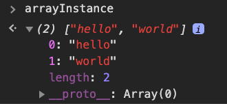
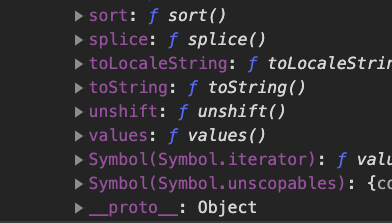

<!-- theme: uncover -->
<!-- _class: invert -->
<!-- paginate: true -->

# JavaScript を書き始める前に知っておきたい JavaScript のこと #02

Kanazawa.js
Remote Meetup #03

千葉 弘太郎

---

千葉 弘太郎（ちば こうたろう）
Kotaro Chiba

- Twitter: [@ur_uha](https://twitter.com/ur_uha)
- Github: [uruha](https://github.com/uruha)
- Work: DMM.com LLC

---

### 前回

[JavaScript を書き始める前にやっておきたいこと](https://speakerdeck.com/uruha/javascript-woshu-kishi-meruqian-nizhi-tuteokitai-javascript-falsekoto)

---

### 今回

- 「ざっくり知る」JavaScript の `prototype` について

---

```js
const arrayInstance = ['hello', 'world'];
arrayInstance.join();

// => 'hello,world'
```

---

なぜ使えるのか？（考えたことあります？）

本来 `arrayInstance` には

`join` メソッドは無いはず...(´・ω・｀)

---

### 原理

`prototype` を辿って（プロトタイプチェーン）、
`Array.prototype.join()` メソッドを使っている。

---

```
Array() ──────── Array.prototype
[prototype]      [constructor, join, ...]
 │                │ arrayInstance は prototype を探しに行く
 │                │
 └ instance → arrayInstance
              ['hello', 'world']
```

---

また、`Array.prototype` は `Object()` の instance、
`Object.prototype` へチェーンが続きます

---

```
                 Object.prototype
                  │
                  │
Array() ──────── Array.prototype
[prototype]      [constructor, join, ...]
 │                │
 │                │
 └ instance → arrayInstance
              ['hello', 'world']
```

---

見てみる。

---


`arrayInstance` がインスタンス化される際に `__proto__` という `prototype` をたどるためのプロパティが存在します。

---


このチェーンは全ての大元である `Object()` まで続きます。

---

ただ、`__proto__` は `ECMA` の**非標準プロパティ**のため、継承元の `prototype` を取得するなど実際にソースコードレベルで使用する場合は `Object.getPrototypeOf` を使ったほうが良いです。

---

```
                 Object.prototype
                  │
                  │
Array() ──────── Array.prototype
[prototype]      [constructor, join, ...]
 │                │
 │                │
 └ instance ┬→ arrayInstance
            ├→ arrayInstance_02
            ├→ arrayInstance_03
            ├→ ...
```
また、全てのインスタンスが、共通の `prototype` を継承しているのも特徴です。

---

### まとめ
- 自作のオブジェクトがビルトイン/ネイティブオブジェクトのメソッドを使えるのは**プロトタイプチェーン**によって、継承元のメソッドを参照しているから
- 自作のオブジェクトをインスタンス化した際に `prototype` プロパティが付与され遡ることができる
- `prototype` の遡りは `Object` まで続く
- 全てのインスタンスは共通の `prototype` を継承している

---

もっと踏み込むといろいろあるんですが、
とりあえず仕組みを理解するところまで。

---

## 次回予告 (参加できたら)

---

### JavaScript を書き始めたら知っておきたい JavaScript のこと

- JavaScript についてもう少し詳しく
  - オブジェクト指向
  - ~~prototype 継承~~
  - 動的型付け
  - シングルスレッド

**動的型付け**や**シングルスレッド**らへんを喋らたら
